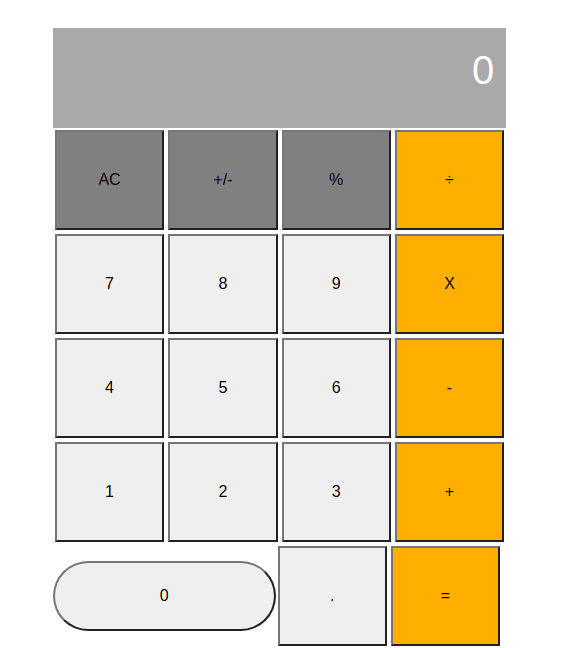

 

# REACT CALCULATOR

> I built a calculator for Math-magicians Inc using create-react-app, a tool built by developers at Facebook

## Built With

- Node.js
- React
- React-DOM
- React-Create-App
- npm
- CSS
- ES6

## Live Demo

[Live Demo Link](https://stark-taiga-18224.herokuapp.com/)

## Prerequisites
1. [Node](https://nodejs.org/en/)
2. [Yarn](https://yarnpkg.com/)

## Getting Started

To get a local copy up and running follow these simple example steps.

- Git clone `https://github.com/mimipeshy/calculator-react.git`
- Run `yarn` to install the dependencies
- To start the dev server, run `npm start` or `yarn start`
- Explore the website 

### How to run tests
- To run tests you can simply run `yarn test` or `npm test` on your terminal

## Authors

👤 **Author1**

- GitHub: [@mimipeshy](https://github.com/mimipeshy)
- Twitter: [@pygirl254](https://twitter.com/pygirl254)
- LinkedIn: [peris-ndanu](https://www.linkedin.com/in/peris-ndanu-405083193/)

## 🤝 Contributing

Contributions, issues, and feature requests are welcome!

Feel free to check the [issues page](https://github.com/mimipeshy/calculator-react/issues).

## Show your support

Give a ⭐️ if you like this project!

## Acknowledgments

- Hat tip to anyone whose code was used
- Inspiration
- etc
